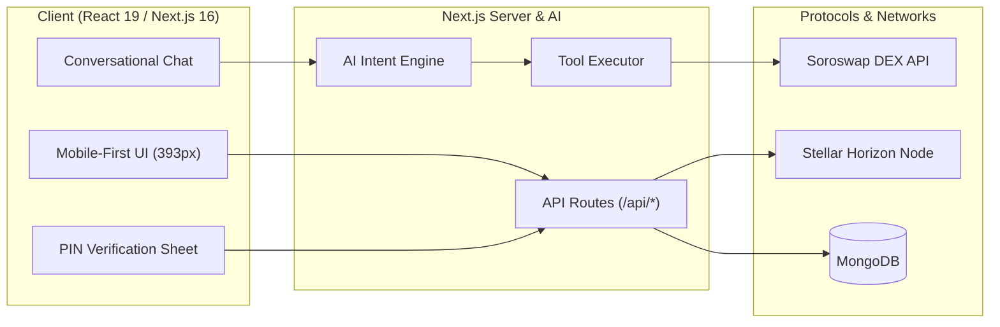

<p align="center" style="margin-bottom: 40px;">
  
</p>

<p align="center">
  <strong>Jumpa is a non-custodial financial assistant that abstracts blockchain complexity through an AI-driven conversational interface. Users can manage funds, query live balances, swap digital assets, and bridge fiat currencies simply by chatting naturally in plain English.</strong>
</p>

<p align="center">
  
  
  
  
  
  
</p>

---

## Quick Navigation

- [Project Summary](#project-summary)
- [Documentation & Tranche Verification](#documentation--tranche-verification)
- [Frontend Design System & Architecture](#frontend-design-system--architecture)
- [Environment Configuration (`.env`)](#environment-configuration-env)
- [Getting Started & Local Development](#getting-started--local-development)
- [Project Layout & Directory Structure](#project-layout--directory-structure)
- [Core Architecture & Tech Stack](#core-architecture--tech-stack)

---

## Project Summary

**Jumpa** is a non-custodial financial assistant that abstracts blockchain complexity through an AI-driven conversational interface. Users can manage funds, query live balances, swap digital assets, and bridge fiat currencies simply by chatting naturally in plain English.

### Key Capabilities
- **Conversational Financial Engine:** Process intents such as *"Swap 10 XLM to USDC on testnet"*, *"What's my balance?"*, or *"Claim test tokens"* into on-chain actions.
- **Sovereign Non-Custodial Security:** BIP-39 mnemonic seeds generated in the background, encrypted locally via AES-256-GCM + PIN, deriving standardized Stellar (`m/44'/148'/0'`), EVM, and Solana addresses.
- **Soroswap DEX Routing & Soroban Smart Contracts:** On-chain router quoting (`router_get_amounts_out`) and direct Soroban smart contract execution (`swap_exact_tokens_for_tokens` via `invoke_host_function`) against Soroswap liquidity pools.
- **DeFi Yield Target Savings:** Automated USDC deposits into DeFindex Soroban smart contract vaults with real-time APY tracking.
- **Multi-Chain Portfolio Aggregation:** Concurrent balance synchronization across Stellar Horizon (Testnet & Mainnet), Base/EVM, and Solana.
- **Integrated Hosted Ramps:** Responsive checkout bottom sheets for fiat deposit and withdrawal gateways (Switch, MoneyGram, Mercuryo).

---

## Documentation & Tranche Verification

| Guide | Description |
| :--- | :--- |
| **[Tranche 1 Completion Guide](docs/TRANCHE_1_COMPLETE.md)** | Core technical architecture, Stellar Horizon synchronization, SEP-24 ramps staging, and baseline SDK foundations. |
| **[Tranche 2 Completion Guide](docs/TRANCHE_2_COMPLETE.md)** | End-to-end chat swaps via on-chain Soroswap Router (`invoke_host_function`), DeFindex savings yield, Allbridge Core bridging, and verified hashes. |
| **[Step-by-Step Testing Guide](docs/HOW_TO_TEST.md)** | Walkthrough on sign-up OTP, PIN setup, Friendbot faucet activation, conversational DEX swaps, savings goals, and bridging. |

---

## Frontend Design System & Architecture

Jumpa is crafted around a strict mobile-first design system optimized for modern mobile viewports (baseline **393 × 852 px**) and centred with a responsive maximum container width (`--container-app: 450px`).

### 1. The Single Styling Rule: Global Static Tokens
Every color, font, radius, shadow, and gradient is declared once in [`app/globals.css`](app/globals.css) inside `@theme static`.

```css
@theme static {
  --color-jumpa-primary-600: #8f12ff; /* Brand core purple */
  --color-jumpa-alt-400: #d5ff19;     /* Vibrant lime accent */
  --color-jumpa-warm-50: #fffbf4;     /* Conversational money card canvas */
  --container-app: 450px;             /* Standardized container width */
}
```

### 2. Tailored Color Palette
- **Brand Primary (Purple):** Ranging from `jumpa-primary-50` (`#f5f0ff`) up to deep `jumpa-primary-950` (`#370078`), with `jumpa-primary-600` (`#8f12ff`) powering primary actions, CTA buttons, and brand backdrops.
- **Alt Highlight (Lime Accent):** Vibrant accent `jumpa-alt-400` (`#d5ff19`) used for active indicators, badges, and attention-grabbing cues.
- **Warm Money Paper Palette:** `jumpa-warm-50` (`#fffbf4`) to `jumpa-warm-200` (`#f4e5d2`) used for conversational transaction cards (`QuoteCard`, `TransferCard`, `ReceiptCard`) to deliver a warm, approachable financial UI rather than sterile grey boxes.
- **Neutral & Surface Hierarchy:** `jumpa-neutral-25` through `jumpa-neutral-900` for hairline borders, card surfaces, and readable typography contrast.

### 3. Typography
- **All UI Copy:** **Geist**, the face the Figma file specifies, loaded as a single variable Google font (100–900) in `app/layout.tsx`. One family at every size — there is no size-keyed switch, so a new heading needs no registration anywhere.
- **Code Blocks & Monospace:** **Geist Mono** for developer logs, addresses, and transaction hashes.
- `--font-display` and `--font-numeric` stand in for **Gotham Ultra** and **Neue Montreal**, which the design calls for but which are licensed and not ours to ship. Both alias Geist until that is settled.
- **Semantic Tokens:**
  | Token | Utility | Usage |
  | :--- | :--- | :--- |
  | `--font-sans` | `font-sans` | Small UI copy — labels, body, captions |
  | `--font-display` | `font-display` | Headings, oversized currency and hero numbers |
  | `--font-numeric` | `font-numeric` | PIN digits, keypads, and counters |
  | `--font-mono` | `font-mono` | Explorer hashes, addresses, and code blocks |

### 4. Interactive Components & Micro-Animations
- **Bottom Sheets:** [`components/ui/bottom-sheet.tsx`](components/ui/bottom-sheet.tsx) provides animated spring overlays (`animate-sheet-up`, `animate-fade`) with safe-area inset padding for PIN verification and balance breakdowns.
- **Conversational Cards:** Interactive components in [`components/chat/`](components/chat/) for live quotes ([`quote-card.tsx`](components/chat/quote-card.tsx)), payment checkouts ([`onramp-checkout-card.tsx`](components/chat/onramp-checkout-card.tsx)), and confirmed receipts ([`receipt-card.tsx`](components/chat/receipt-card.tsx)).
- **Staggered Entry Transitions:** [`components/ui/rise-in.tsx`](components/ui/rise-in.tsx) animates dashboard sections sequentially from top to bottom.
- **Drag-to-Dismiss Sheets:** [`hooks/use-sheet-drag.ts`](hooks/use-sheet-drag.ts) backs both sheet primitives — pull the handle (or the panel, when its content is scrolled to the top) past 96px, or flick it, to close. The scrim, Escape and tap-out are unchanged.
- **Date Picker:** [`components/ui/date-field.tsx`](components/ui/date-field.tsx) replaces the native `<input type="date">`, which each platform draws differently. It opens the app's own calendar (`react-day-picker`) in a sheet and keeps the value as `YYYY-MM-DD`.

---

## Environment Configuration (.env)

Create a `.env` file in the root directory by copying `.env.example`:

```bash
cp .env.example .env
```

### Environment Variables Reference

| Variable | Required | Description | Example / Default |
| :--- | :--- | :--- | :--- |
| `MONGO_URI` | **Yes** | MongoDB connection string for users, wallets, and logs | `mongodb://localhost:27017/jumpa` |
| `AUTH_SECRET` | **Yes** | 32+ character random secret for BetterAuth session encryption | `openssl rand -hex 32` |
| `AUTH_URL` / `BETTER_AUTH_URL` | **Yes** | Base application URL | `http://localhost:3000` |
| `WALLET_PEPPER_SECRET` | **Yes** | Server pepper used for salt derivation | Random 32+ character string |
| `ENCRYPTION_KEY` | **Yes** | Encryption key for securing sensitive records | Random 32+ character string |
| `STELLAR_TESTNET` | **Yes** | Stellar Testnet Horizon RPC endpoint | `https://horizon-testnet.stellar.org` |
| `STELLAR_MAINNET` | **Yes** | Stellar Mainnet Horizon RPC endpoint | `https://horizon.stellar.org` |
| `SOROSWAP_API_URL` | **Yes** | Soroswap REST API base URL | `https://api.soroswap.finance` |
| `SOROSWAP_API_KEY` | **Yes** | Soroswap API key for quote routing and building XDR | Your Soroswap API Key |
| `RESEND_API_KEY` | Optional | Resend API key for sending email OTP codes | `re_123456789` |
| `RESEND_FROM_EMAIL` | Optional | Sender email address for OTP transport | `onboarding@resend.dev` |
| `GOOGLE_CLIENT_ID` | Optional | Google OAuth client ID for social sign-in | `your_google_client_id` |
| `GOOGLE_CLIENT_SECRET` | Optional | Google OAuth client secret | `your_google_client_secret` |
| `SWITCH_SANDBOX_URL` | Optional | Sandbox base URL for Switch fiat ramps | `https://switch-3.gitbook.io/api` |
| `SWITCH_SANDBOX_KEY` | Optional | Switch sandbox authentication API key | `sandbox_key_...` |
| `NEXT_PUBLIC_SOLANA_RPC` | Optional | Solana RPC endpoint for balance lookups | `https://api.mainnet-beta.solana.com` |
| `EVM_RPC_URL` | Optional | EVM RPC endpoint (Sepolia / Base) | `https://sepolia.drpc.org` |

---

## Getting Started & Local Development

### Prerequisites
- **Node.js**: v20.0 or higher (v20+ recommended)
- **MongoDB**: Local MongoDB instance (`mongodb://localhost:27017`) or MongoDB Atlas cluster

### Installation

```bash
# 1. Clone the repository
git clone https://github.com/official-jumpa/jumpa-web-app.git
cd jumpa-web-app

# 2. Install dependencies
npm install

# 3. Configure environment variables
cp .env.example .env

# 4. Start the development server
npm run dev
```

The application will be live at **`http://localhost:3000`**.

### Scripts & Tooling

| Command | Purpose |
| :--- | :--- |
| `npm run dev` | Starts the Next.js local development server |
| `npm run build` | Compiles production bundle — **must pass before merging PRs** |
| `npm run start` | Starts the Next.js production server |
| `npm run lint` | Runs Biome checks (linting + format verification) |
| `npm run format` | Automatically applies Biome formatting across the workspace |
---

## Project Layout & Directory Structure

```
jumpa-web-app/
├── app/                      # Next.js 16 App Router pages, layouts, and API routes
│   ├── (app)/                # Authenticated application screens (home, chat, savings, swap, settings)
│   ├── (auth)/               # Authentication & onboarding flows (login, OTP, PIN)
│   ├── api/                  # REST backend handlers
│   │   ├── auth/             # BetterAuth handlers & session verification
│   │   ├── chat/             # Chat prompt dispatch (/send) & transaction confirmation (/confirm)
│   │   ├── savings/          # DeFindex savings vaults (/create, /top-up, /withdraw)
│   │   ├── swap/             # Soroswap DEX routes (/quote, /build, /execute)
│   │   ├── switch/           # Fiat on/off-ramp webhook & status routes
│   │   └── wallet/           # Wallet balance sync, send, & faucet funding
│   └── globals.css           # Global static design tokens & Tailwind theme
├── components/               # React 19 UI component library
│   ├── auth/                 # OTP verification, PIN inputs, and recovery phrase components
│   ├── chat/                 # Conversational UI, QuoteCard, ReceiptCard, PIN Sheet
│   ├── home/                 # Asset list, balance panels, quick actions, bottom nav
│   ├── savings/              # Target savings dashboard, goal creation, top-up sheets
│   ├── swap/                 # Standalone DEX swap view & settings sheet
│   └── ui/                   # Generic primitives (Button, TextField, BottomSheet, Icons)
├── docs/                     # Technical specifications and testing guides
│   ├── HOW_TO_TEST.md        # Step-by-step testnet walkthrough
│   ├── TRANCHE_1_COMPLETE.md # Tranche 1 architecture & verification proofs
│   └── TRANCHE_2_COMPLETE.md # Tranche 2 architecture & verification proofs
├── lib/                      # Core business logic & blockchain integration
│   ├── ai/                   # AI intent engine, tool schemas, and tool execution dispatcher
│   ├── bridge.ts             # Allbridge Core cross-chain stablecoin quoting
│   ├── chains/               # Chain integrations (Stellar Horizon, Soroban, Solana, EVM)
│   │   └── stellar/          # Key derivation, Horizon client, DeFindex vault client, state sync
│   ├── dex/                  # Decentralized exchange connectors (Soroswap on-chain Router client)
│   └── crypto.ts             # AES-256-GCM encryption & secure mnemonic hashing
├── models/                   # Mongoose database schemas (User, Wallet, Transaction, SavingsPlan, ChatLog)
└── public/                   # Static assets, SVG coin badges, and brand marks
```

---

## Core Architecture & Tech Stack



- **Framework:** Next.js 16 (App Router, Server Components)
- **Language:** TypeScript 5 (Strict mode)
- **Styling:** Tailwind CSS v4 + Static Design Tokens
- **Blockchain SDKs:** `@stellar/stellar-sdk`, `ed25519-hd-key`, `bip39`, `viem`, `@solana/web3.js`
- **Database & Auth:** MongoDB with Mongoose, BetterAuth
- **Code Quality:** Biome Linter & Formatter
