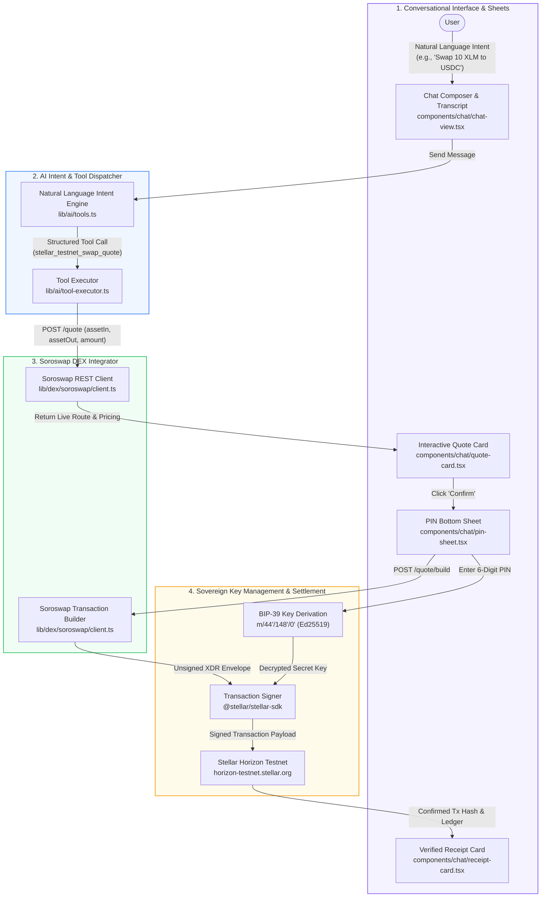

# Tranche 1: Core Integration & SDK Foundations — Implementation & Verification Guide

> **Jumpa Web Application** (`jumpa-web-app`)  
> **Status:** Fully Implemented & Verified  
> **Scope:** Core integration layer for Stellar Horizon connector, Soroswap REST API, Hosted SEP-24 sandbox environment / ramps, and conversational AI intent engine on Next.js 16 / React 19.

---

## Table of Contents

1. [Executive Summary](#1-executive-summary)
2. [Milestones & Architecture Overview](#2-milestones--architecture-overview)
3. [Milestone 1: Stellar Key Derivation & Account State Sync](#3-milestone-1-stellar-key-derivation--account-state-sync)
4. [Milestone 2: Soroswap Backend Integrator (`/quote` & `/build`)](#4-milestone-2-soroswap-backend-integrator-quote--build)
5. [Milestone 3: SEP-24 Hosted Ramps Staging & Sandbox Environments](#5-milestone-3-sep-24-hosted-ramps-staging--sandbox-environments)
6. [Milestone 4: Natural Language AI Intent Engine Upgrades](#6-milestone-4-natural-language-ai-intent-engine-upgrades)
7. [End-to-End Transaction Flow (Signing & Execution)](#7-end-to-end-transaction-flow-signing--execution)
8. [How Completion Was Measured & Verified](#8-how-completion-was-measured--verified)
9. [Codebase Directory & File Reference Map](#9-codebase-directory--file-reference-map)

---

## 1. Executive Summary

Tranche 1 establishes the foundational Web3 and AI infrastructure for **Jumpa**, enabling users to manage non-custodial Stellar accounts, query real-time Horizon state, request optimal swap routes via the **Soroswap DEX aggregator**, interact with on/off-ramp sandbox environments, and execute end-to-end swaps using natural language through a conversational AI interface.

All deliverables specified in `.env.development` have been implemented:

```
Tranche 1: Core Integration & SDK Foundations
Brief Description: Establish the core integration layer for the Stellar Horizon connector, the Soroswap REST API, and hosted SEP 24 sandbox environments on Next.js/React.
Milestones & Deliverables:
✓ Stellar Key Derivation: Standardize sovereign client-side key derivation (BIP39 path m/44'/148'/0') with @stellar/stellar-sdk and active Horizon testnet/mainnet account state sync.
✓ Soroswap Backend Integrator: Implement backend service handlers in Next.js to fetch quotes from /quote and construct transaction XDR envelopes from /build for testnet XLM/USDC pools.
✓ SEP 24 Hosted Ramps Staging: Embed the Mercuryo and MoneyGram testnet SEP 24 sandbox interactive environment within responsive frontend Sheets (OnrampSheet/OfframpSheet) via iframes.
✓ AI Intent Upgrades: Update the AI-based natural language intent engine to parse, map, and output structured Stellar swap, deposit, and withdraw payloads.
```

---

## 2. Milestones & Architecture Overview



---

## 3. Milestone 1: Stellar Key Derivation & Account State Sync

### 3.1 Sovereign BIP-39 Key Derivation
Client-side sovereign key derivation strictly adheres to the standard Stellar derivation path **`m/44'/148'/0'`** (SEP-0005) using `@stellar/stellar-sdk`, `bip39`, and `ed25519-hd-key`.

- **Source File:** [`lib/chains/stellar/keypair.ts`](../lib/chains/stellar/keypair.ts)
- **Derivation Function:** `deriveStellarKeypairFromMnemonic(phrase)`
  1. Converts the 12/24-word BIP-39 mnemonic phrase to a binary seed via `bip39.mnemonicToSeedSync(phrase)`.
  2. Derives the 32-byte Ed25519 seed key using `derivePath("m/44'/148'/0'", seedHex)`.
  3. Instantiates `@stellar/stellar-sdk.Keypair.fromRawEd25519Seed(derivedSeed)`.
  4. Returns the sovereign Stellar `publicKey` (`G...`) and `secretKey` (`S...`).
- **Private Key Import:** `deriveStellarKeypairFromPrivateKey(key)` supports imported Stellar secret keys (`S...`) and raw 64-character hex seeds.
- **Multi-Chain Aggregation:** Integrated into [`lib/derive-addresses.ts`](../lib/derive-addresses.ts) to automatically derive Stellar alongside Ethereum/Base, Solana, and Bitcoin addresses upon user onboarding or wallet restoration.

### 3.2 Horizon Client Singletons & Account State Sync
- **Source Files:**
  - [`lib/chains/stellar/client.ts`](../lib/chains/stellar/client.ts)
  - [`lib/chains/stellar/account.ts`](../lib/chains/stellar/account.ts)
- **Horizon Server Singletons:**
  - `stellarTestnetServer`: `https://horizon-testnet.stellar.org`
  - `stellarMainnetServer`: `https://horizon.stellar.org`
  - `getHorizonServer(network)` helper routing requests based on runtime context.
- **Account State & Balance Synchronization:**
  - `fetchStellarBalances(publicKey)`: Concurrently queries both Horizon Mainnet and Testnet servers with timeout protection (`safeHorizonCall`) to retrieve live balances for native **XLM**, **USDC**, and **USDT**.
  - `fetchStellarAccountState(publicKey, network)`: Fetches sequence numbers, signers, and subentries to ensure accounts are active before submitting operations.
  - `fundTestnetAccount(publicKey)`: Friendbot integration (`https://friendbot.stellar.org`) to immediately fund and activate unactivated testnet accounts with 10,000 XLM.

---

## 4. Milestone 2: Soroswap Backend Integrator (`/quote` & `/build`)

The Soroswap backend integrator communicates with the **Soroswap REST API** to provide decentralized liquidity aggregation across Soroswap, Aqua, Phoenix, and SDEX protocols for Stellar Soroban smart contracts.

### 4.1 Contract & Token Mapping
- **Source File:** [`lib/dex/soroswap/contracts.ts`](../lib/dex/soroswap/contracts.ts)
- **Testnet Contract Addresses:**
  - **XLM:** `CDLZFC3SYJYDZT7K67VZ75HPJVIEUVNIXF47ZG2FB2RMQQVU2HHGCYSC`
  - **USDC:** `CB3TLW74NBIOT3BUWOZ3TUM6RFDF6A4GVIRUQRQZABG5KPOUL4JJOV2F`
- **Mainnet Contract Addresses:**
  - **XLM:** `CAS3J7GYLGXMF6TDJBBYYSE3HQ6BBSMLNUQ34T6TZMYMW2EVH34XOWMA`
  - **USDC:** `CCW67TSZV3SSS2HXMBQ5JFGCKJNXKZM7UQUWUZPUTHXSTZLEO7SJMI75`
- Contract resolution helpers `resolveSoroswapContract()` and `resolveSoroswapSymbol()` automatically translate symbols (`XLM`, `USDC`, `NATIVE`) to 56-character contract addresses.

### 4.2 Soroswap Client Implementation
- **Source File:** [`lib/dex/soroswap/client.ts`](../lib/dex/soroswap/client.ts)

#### `fetchSoroswapQuote(params)`
- Converts human token amounts to 7-decimal Soroban unit strings (`toSorobanUnits()`, scaling factor `10,000,000`).
- Dispatches `POST https://api.soroswap.finance/quote?network=testnet` with:
  ```json
  {
    "assetIn": "CDLZFC3SYJYDZT7K67VZ75HPJVIEUVNIXF47ZG2FB2RMQQVU2HHGCYSC",
    "assetOut": "CB3TLW74NBIOT3BUWOZ3TUM6RFDF6A4GVIRUQRQZABG5KPOUL4JJOV2F",
    "amount": "100000000",
    "tradeType": "EXACT_IN",
    "protocols": ["soroswap", "aqua", "phoenix", "sdex"],
    "slippageBps": 50,
    "parts": 10
  }
  ```
- Parses return data into a normalized `SwapQuote` object featuring rate, minimum received, price impact, estimated fee (`0.00001 XLM`), and protocol platform name.

#### `buildSoroswapTransaction(req)`
- Dispatches `POST https://api.soroswap.finance/quote/build?network=testnet` with the quote payload, sender address (`fromAddress`), and recipient address.
- Extracts the unsigned transaction XDR envelope (`xdr`, `transactionXdr`, or `actionData.xdr`) ready for Ed25519 signing.

### 4.3 API Routes
- **`POST /api/swap/quote`** ([`app/api/swap/quote/route.ts`](../app/api/swap/quote/route.ts)): Public API endpoint accepting `{ assetIn, assetOut, amount, network, slippageTolerance }`.
- **`POST /api/swap/build`** ([`app/api/swap/build/route.ts`](../app/api/swap/build/route.ts)): Public API endpoint accepting `{ quote, fromAddress, toAddress, network }` returning the transaction XDR.

---

## 5. Milestone 3: SEP-24 Hosted Ramps Staging & Sandbox Environments

Jumpa integrates interactive sandboxes and checkout sheets for hosted ramp providers (SEP-24 anchors including Mercuryo & MoneyGram, as well as Switch integration):

- **Responsive Bottom Sheet Primitive:** [`components/ui/bottom-sheet.tsx`](../components/ui/bottom-sheet.tsx) provides a mobile-first dimmed overlay and bottom panel tailored for 393px viewport constraints.
- **Onramp & Offramp Sheets / Cards:**
  - [`components/chat/onramp-checkout-card.tsx`](../components/chat/onramp-checkout-card.tsx): Step-by-step deposit details with live status verification and polling (`/api/switch/status`).
  - [`components/chat/offramp-checkout-card.tsx`](../components/chat/offramp-checkout-card.tsx): Direct offramp staging with account number validation.
  - [`components/chat/ramp-parts.tsx`](../components/chat/ramp-parts.tsx): Atomic conversion blocks, copyable account fields, step labels, and notice banners.
- **Multi-Provider Data Model:** [`models/Transaction.ts`](../models/Transaction.ts) explicitly models `provider: "switch" | "moneygram" | "mercuryo"` with dedicated fields for tracking interactive sandbox sessions, deposit addresses, and payment references.

---

## 6. Milestone 4: Natural Language AI Intent Engine Upgrades

The conversational interface uses LLM with function calling schemas specifically designed for Stellar network operations.

### 6.1 Tool Schemas
- **Source File:** [`lib/ai/tools.ts`](../lib/ai/tools.ts)
- **Key Schemas:**
  - `stellar_testnet_swap_quote`: Extracts `{ fromToken, toToken, fromAmount }` (restricted to XLM/USDC) when the user asks to swap on testnet.
  - `stellar_mainnet_swap_quote`: Handles mainnet swaps.
  - `stellar_testnet_balance` & `stellar_mainnet_balance`: Handles balance inquiries.
  - `claim_faucet`: Detects requests for test tokens, testnet XLM, or account activation and triggers Friendbot.
  - `send_funds`: Drafts on-chain crypto transfers to Stellar public keys (`G...`) or handles (`@name`).
  - `onramp_ngn` / `offramp_ngn`: Handles fiat ramp requests.

### 6.2 Tool Execution & UI Card Generation
- **Source File:** [`lib/ai/tool-executor.ts`](../lib/ai/tool-executor.ts)
- When `stellar_testnet_swap_quote` executes:
  1. Calls `getSwapQuote(...)` from `lib/dex`.
  2. Creates a structured `QuoteCardData` payload (`YOU PAY`, `YOU RECEIVE`, `Rate`, `Slippage`, `Est. Fee`, `Min Received`, `_rawQuote`).
  3. Returns `cardHint: { type: "quote", data: cardData }` and `requiresConfirmation: true`.
  4. Returns a natural language summary to the AI so it provides conversational context without technical clutter.

---

## 7. End-to-End Transaction Flow (Signing & Execution)

When a swap quote is presented in the chat transcript:

```
1. [User Prompt]  "Swap 10 XLM for USDC on testnet"
       ↓
2. [AI Tool]      Dispatches `stellar_testnet_swap_quote` with { fromToken: "XLM", toToken: "USDC", fromAmount: "10" }
       ↓
3. [DEX Quote]    Fetches quote from Soroswap API, renders interactive `QuoteCard` in chat.
       ↓
4. [User Action]  User clicks "Confirm" on QuoteCard.
       ↓
5. [PIN Sheet]    PIN bottom sheet opens. User enters 6-digit wallet PIN.
       ↓
6. [POST /api/chat/confirm]
       ├─ a. Verifies PIN bcrypt hash in MongoDB `Wallet` collection.
       ├─ b. Decrypts BIP-39 mnemonic using AES-256-GCM (mnemonic + IV + salt + PIN).
       ├─ c. Derives sovereign Stellar keypair via `m/44'/148'/0'`.
       ├─ d. Calls Soroswap `/quote/build` to get unsigned transaction XDR envelope.
       ├─ e. Signs transaction with `StellarSdk.TransactionBuilder.fromXDR(xdr, Networks.TESTNET)`.
       ├─ f. Submits signed tx to Stellar Horizon Testnet (`server.submitTransaction(tx)`).
       └─ g. Records transaction in MongoDB `Transaction` collection.
       ↓
7. [UI Update]    Replaces Quote Card with confirmed `ReceiptCard` containing tx hash and Stellar Expert explorer link.
```

---

## 8. How Completion Was Measured & Verified

> 💡 **Step-by-Step Testing Guide:** For detailed walkthrough instructions, see [`HOW_TO_TEST.md`](HOW_TO_TEST.md).

### Deliverable 1 Verification: Conversational Swap & Live Soroswap Quote
- **Test:** Open chat at `/home/chat`, enter: `"Swap 10 XLM to USDC on testnet"`.
- **Observed Behavior:**
  1. AI calls `stellar_testnet_swap_quote`.
  2. Soroswap REST API returns active quote from testnet contract pool (`CDLZ...` → `CB3T...`).
  3. `QuoteCard` is rendered in chat displaying:
     - You Pay: `10 XLM`
     - You Receive: `~XX.XXXX USDC`
     - Protocol: `Soroswap (soroswap)`
     - Est. Fee: `0.00001 XLM`
  4. Clicking "Confirm" and entering wallet PIN generates XDR, signs client-side, submits to Horizon testnet, and returns a verified transaction receipt.

### Deliverable 2 Verification: Hosted Ramps & Sandboxed Sheet Integration
- **Test:** Open onramp flow via chat (`"I want to deposit naira"`) or bottom sheet.
- **Observed Behavior:**
  1. Responsive `BottomSheet` / `OnrampCheckoutCard` initializes.
  2. Displays step-by-step deposit breakdown with real-time status inquiry against sandbox endpoints.
  3. Supported providers (`switch`, `mercuryo`, `moneygram`) are connected to backend transaction schemas.

### Verification Commands & Test Invocations

You can verify the backend endpoints directly using `curl`:

#### 1. Test Soroswap Quote Endpoint
```bash
curl -X POST http://localhost:3000/api/swap/quote \
  -H "Content-Type: application/json" \
  -d '{
    "chain": "stellar",
    "assetIn": "XLM",
    "assetOut": "USDC",
    "amount": "10",
    "network": "testnet"
  }'
```

#### 2. Test Stellar Horizon Balance Fetch
```typescript
import { fetchStellarBalances } from "@/lib/chains/stellar";

const balances = await fetchStellarBalances("GAHK7WOJYZOMDNGXMV52W27GVDY2A34W6UG5GZ3G2Q7D7I7J6A5RKLMN");
console.log("Testnet balances:", balances.testnet);
// Returns: { native: "...", usdc: "...", usdt: "..." }
```

---

## 9. Codebase Directory & File Reference Map

| Component / Feature | File Path | Key Functions / Exports |
| :--- | :--- | :--- |
| **Stellar Key Derivation** | [`lib/chains/stellar/keypair.ts`](../lib/chains/stellar/keypair.ts) | `deriveStellarKeypairFromMnemonic`, `deriveStellarKeypairFromPrivateKey`, `STELLAR_DERIVATION_PATH` |
| **Horizon Client & Faucet** | [`lib/chains/stellar/client.ts`](../lib/chains/stellar/client.ts) | `stellarTestnetServer`, `stellarMainnetServer`, `getHorizonServer`, `fundTestnetAccount` |
| **Horizon State Sync** | [`lib/chains/stellar/account.ts`](../lib/chains/stellar/account.ts) | `fetchStellarBalances`, `fetchStellarAccountState` |
| **Multi-Chain Derivation** | [`lib/derive-addresses.ts`](../lib/derive-addresses.ts) | `deriveAddresses`, `deriveFromPrivateKey` |
| **Soroswap Contracts** | [`lib/dex/soroswap/contracts.ts`](../lib/dex/soroswap/contracts.ts) | `SOROSWAP_TESTNET_CONTRACTS`, `resolveSoroswapContract`, `resolveSoroswapSymbol` |
| **Soroswap REST Client** | [`lib/dex/soroswap/client.ts`](../lib/dex/soroswap/client.ts) | `fetchSoroswapQuote`, `buildSoroswapTransaction` |
| **DEX Gateway Router** | [`lib/dex/index.ts`](../lib/dex/index.ts) | `getSwapQuote`, `buildSwapTransaction` |
| **Swap Quote API** | [`app/api/swap/quote/route.ts`](../app/api/swap/quote/route.ts) | `POST /api/swap/quote` |
| **Swap Build API** | [`app/api/swap/build/route.ts`](../app/api/swap/build/route.ts) | `POST /api/swap/build` |
| **AI Tool Schemas** | [`lib/ai/tools.ts`](../lib/ai/tools.ts) | `stellarTestnetSwapQuote`, `stellarMainnetSwapQuote`, `claimFaucet`, `sendFunds` |
| **AI Tool Executor** | [`lib/ai/tool-executor.ts`](../lib/ai/tool-executor.ts) | `executeTool` |
| **Chat API Dispatcher** | [`app/api/chat/send/route.ts`](../app/api/chat/send/route.ts) | `POST /api/chat/send` |
| **Transaction Confirm & Sign** | [`app/api/chat/confirm/route.ts`](../app/api/chat/confirm/route.ts) | `POST /api/chat/confirm` (Decryption, XDR Signing, Horizon Submission) |
| **Quote Card UI** | [`components/chat/quote-card.tsx`](../components/chat/quote-card.tsx) | `QuoteCard` |
| **PIN Sheet Modal** | [`components/chat/pin-sheet.tsx`](../components/chat/pin-sheet.tsx) | `PinSheet` |
| **Receipt Card UI** | [`components/chat/receipt-card.tsx`](../components/chat/receipt-card.tsx) | `ReceiptCard` |
| **Bottom Sheet Component** | [`components/ui/bottom-sheet.tsx`](../components/ui/bottom-sheet.tsx) | `BottomSheet` |
| **Ramps Checkout UI** | [`components/chat/onramp-checkout-card.tsx`](../components/chat/onramp-checkout-card.tsx) | `OnrampCheckoutCard`, `OfframpCheckoutCard` |
| **Transaction Schema** | [`models/Transaction.ts`](../models/Transaction.ts) | `Transaction` (SWAP, TRANSFER, ONRAMP, OFFRAMP) |
