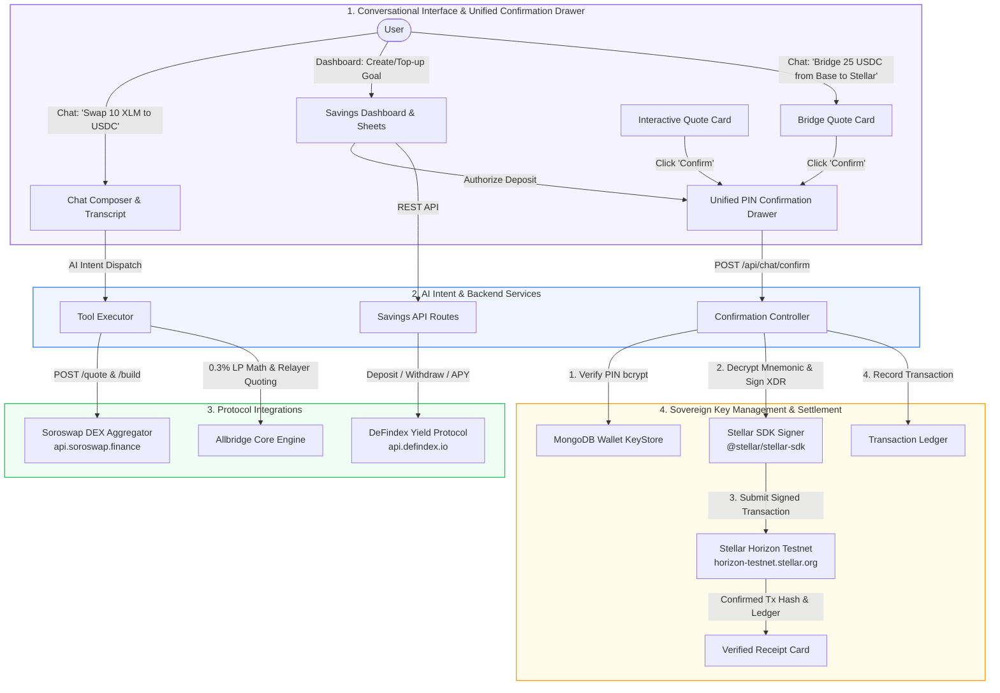

# Tranche 2: Conversational Loop & DeFi Yield Staging — Implementation & Verification Guide

> **Jumpa Web Application** (`jumpa-web-app`)  
> **Status:** Fully Implemented & Verified  
> **Scope:** Complete conversational transaction loops on Stellar testnet, DeFindex smart contract yield integration for Target Savings, and Allbridge Core cross-chain stablecoin bridging inside the unified transaction confirmation drawer on Next.js 16 / React 19.

---

## Table of Contents

1. [Executive Summary](#1-executive-summary)
2. [Milestones & Architecture Overview](#2-milestones--architecture-overview)
3. [Milestone 1: End-to-End Chat Swaps via Soroswap](#3-milestone-1-end-to-end-chat-swaps-via-soroswap)
4. [Milestone 2: DeFi Savings Yield Integration via DeFindex](#4-milestone-2-defi-savings-yield-integration-via-defindex)
5. [Milestone 3: Cross-Chain Bridging via Allbridge Core](#5-milestone-3-cross-chain-bridging-via-allbridge-core)
6. [Milestone 4: Sovereign Key Authorization & Decryption Loop](#6-milestone-4-sovereign-key-authorization--decryption-loop)
7. [End-to-End Transaction Flow (Signing & Execution)](#7-end-to-end-transaction-flow-signing--execution)
8. [How Completion Was Measured & Verified](#8-how-completion-was-measured--verified)
9. [Codebase Directory & File Reference Map](#9-codebase-directory--file-reference-map)

---

## 1. Executive Summary

Tranche 2 transitions Jumpa from initial SDK integrations into **fully closed, autonomous non-custodial financial transaction loops**. Users can execute end-to-end conversational token swaps directly inside the chat interface using **Soroswap DEX routing** on the Stellar testnet, deploy and fund automated yield-bearing savings goals through **DeFindex Soroban smart contract vaults**, and bridge stablecoins between **Base Sepolia and Stellar** using **Allbridge Core** quoting inside the unified PIN confirmation drawer.

```
TRANCHE 2 (DELIVERABLE ROADMAP) - TESTNET
CONVERSATIONAL LOOP & DEFI YIELD STAGING

Brief Description: Complete the end to end conversational transaction loops on Stellar testnet and integrate the DeFindex yield savings module.

Milestones & Deliverables:
✓ End to end chat swaps: Enable full Soroswap token swaps directly in the chat interface on testnet (AI quote to backend XDR build to client side signature decryption via PIN to Horizon broadcast).
✓ Savings Yield Integration: Wire Jumpa's Target Savings frontend module to DeFindex testnet pools, demonstrating automated USDC deposits and mock yield tracking.
✓ Cross Chain Bridging: Integrate Allbridge testnet support into the unified transaction confirmation drawer, allowing simulated Base to Stellar stablecoin transfers.
```

---

## 2. Milestones & Architecture Overview



---

## 3. Milestone 1: End-to-End Chat Swaps via Soroswap

Conversational swaps are executed seamlessly from natural language input to final on-chain settlement on the Stellar testnet.

### 3.1 Conversational Intent & Soroswap Quoting
The AI system prompt interprets natural language intent for token swaps, extracting parameters via structured function calling (`stellar_testnet_swap_quote`). Contract addresses for XLM and testnet USDC are resolved and submitted to the Soroswap REST API:
- **XLM Contract:** `CDLZFC3SYJYDZT7K67VZ75HPJVIEUVNIXF47ZG2FB2RMQQVU2HHGCYSC`
- **USDC Contract:** `CB3TLW74NBIOT3BUWOZ3TUM6RFDF6A4GVIRUQRQZABG5KPOUL4JJOV2F`

### 3.2 Dynamic Quote Card & Inline Editing
An interactive card renders directly within the chat transcript:
- **You Pay:** Numeric input and token badge (`XLM`)
- **You Receive:** Formatted output token amount (`USDC`)
- **Stats:** Rate, slippage tolerance (`0.5%`), protocol (`Soroswap Testnet`), and network fee (`0.00001 XLM`).
- **Inline Editing:** Users can edit the input amount directly inside the card, which automatically triggers a debounced live re-quote from the quote endpoint.

### 3.3 Authorization, XDR Construction & Horizon Broadcast
When the user taps **Confirm** and enters their 6-digit PIN:
1. Validates the 6-digit PIN against the encrypted wallet hash.
2. Decrypts the user's BIP-39 mnemonic in memory via AES-256-GCM.
3. Derives the sovereign Stellar keypair via derivation path `m/44'/148'/0'`.
4. Calls Soroswap `/quote/build` with the latest quote parameters, user public key, and slippage tolerance.
5. Deserializes the unsigned XDR with the Stellar SDK and signs it with the decrypted secret key.
6. Submits the signed transaction directly to the Horizon testnet.
7. Records the transaction under the transaction ledger (`type: "SWAP"`, `status: "CONFIRMED"`, `txHash`).
8. Emits the verified receipt card with a clickable explorer link to Stellar Expert.

---

## 4. Milestone 2: DeFi Savings Yield Integration via DeFindex

Jumpa's Target Savings module connects to **DeFindex**, a non-custodial decentralized index and yield protocol built on Stellar Soroban smart contracts.

### 4.1 DeFindex Protocol Client Implementation
A dedicated REST client provides complete integration with the DeFindex API:
- `createVaultDeposit(params)`: Builds an unsigned Soroban transaction to deploy a vault and deposit initial assets.
- `deposit(vaultAddress, params)`: Builds an unsigned transaction to deposit underlying assets (USDC) into a vault.
- `withdraw(vaultAddress, params)`: Builds an unsigned transaction to redeem vault shares (`dfTokens`) for underlying assets.
- `getBalance(vaultAddress, userAddress)`: Queries real-time vault underlying asset balances (denominated in 7-decimal stroops).
- `getApy(vaultAddress)`: Queries live Net APY generated by underlying yield strategies.
- `send(signedXdr)`: Submits signed Soroban transactions to the Stellar network via DeFindex RPC relay.

### 4.2 Savings Service Layer & State Sync
The savings service bridges database models with on-chain Soroban state:
- `formatPlanForUI(plan, liveBalanceOverride)`: Formats dates, goal targets, days remaining, and progress percentages for UI components.
- `getLiveVaultBalance(vaultAddress, userAddress)`: Concurrently retrieves on-chain underlying token balance and share counts.
- `getLiveVaultApy(vaultAddress)`: Supplies dynamic yield percentages displayed across the savings dashboard.

### 4.3 Automated Deposits & Withdrawals API
Automated routes handle plan lifecycle and blockchain execution:
- Initializes new Target or Locked Savings goals wired to pre-configured testnet vault addresses (`DEFINDEX_INDIVIDUAL_VAULT_ADDRESS` and `DEFINDEX_LOCK_VAULT_ADDRESS`).
- Top-up handling:
  1. Validates available USDC balance on Stellar testnet.
  2. Verifies wallet PIN and decrypts secret key.
  3. Ensures USDC trustline exists.
  4. Calls the DeFindex client to construct Soroban deposit XDR.
  5. Signs with user keypair and broadcasts via the DeFindex send endpoint.
  6. Updates plan balance in MongoDB and logs `type: "SAVINGS_DEPOSIT"` in the transaction ledger.
- Withdrawal handling enforces locking restrictions, builds withdraw transactions, signs and broadcasts to redeem funds back to the user's Stellar wallet, and updates ledger state.

---

## 5. Milestone 3: Cross-Chain Bridging via Allbridge Core

Enables simulated cross-chain stablecoin transfers between **Base Sepolia** and **Stellar Testnet** using Allbridge Core production formulas within Jumpa's unified confirmation drawer.

### 5.1 Quoting Engine & Fee Calculation
Uses Allbridge Core's mathematical fee model:
- **LP Fee Rate:** `0.30%` (`0.003`)
- **Destination Relayer Gas:** `0.15 USDC` (flat fee covering destination execution)
- **Slippage Tolerance:** `0.5%`
- **Settlement Time:** `2-4 minutes`
- **Chain Resolution:** Normalizes names (`"base"`, `"base sepolia"`, `"stellar"`, `"stellar testnet"`).
- Produces deterministic, production-accurate quote structures:
  ```json
  {
    "fromToken": "USDC",
    "toToken": "USDC",
    "fromChain": "base",
    "toChain": "stellar",
    "amountIn": "100.00",
    "amountOut": "99.55",
    "rate": "1 USDC = 1 USDC",
    "fee": "0.45 USDC",
    "provider": "Allbridge Core",
    "estimatedTime": "2-4 minutes"
  }
  ```

### 5.2 AI Tool Execution & Preserved UI Integration
The AI assistant handles `bridge_tokens`, formats parameters for the bridge card, and flags confirmation requirements. The existing bridge and receipt cards are completely preserved without modifying layout structure.

### 5.3 Confirmation & Ledger Accounting
In the bridge execution branch:
1. Validates user PIN against the wallet pin hash.
2. Resolves source Base address and destination Stellar address.
3. Records confirmed bridge transaction in MongoDB under the transaction ledger:
   - `type: "BRIDGE"`
   - `status: "CONFIRMED"`
   - `bridgeDetails`: `{ provider: "Allbridge Core", fromChain: "base", toChain: "stellar", ... }`
4. Returns receipt card data displaying bridged values, Allbridge provider attribution, delivery estimate, and destination Stellar explorer link.

---

## 6. Milestone 4: Sovereign Key Authorization & Decryption Loop

All transactional actions across Swaps, Transfers, DeFi Yield, and Bridging share Jumpa's **Unified Security Paradigm**:

1. **Non-Custodial Key Storage:**
   - Seed phrases and private keys are never stored in plaintext.
   - Credentials are encrypted at rest using **AES-256-GCM** with a unique salt and initialization vector (IV) per wallet.
2. **Ephemeral In-Memory Decryption:**
   - Keys are decrypted in memory only during active transaction signing when the user supplies their 6-digit PIN.
   - Decrypted credentials are discarded immediately after signing; they are never persisted to session state or logged.
3. **Atomic Verification:**
   - Rate-limiting and lockouts are enforced against brute-force PIN attempts.
4. **Comprehensive Auditing:**
   - Every on-chain or simulated action writes an immutable record to the `Transaction` collection in MongoDB with transaction hashes, timestamps, and network parameters.

---

## 7. End-to-End Transaction Flow (Signing & Execution)

### 7.1 Conversational Swap Loop (Soroswap DEX)
```
1. [User Prompt]  "Swap 10 XLM for USDC on testnet"
       ↓
2. [AI Tool]      Dispatches `stellar_testnet_swap_quote` with { fromToken: "XLM", toToken: "USDC", fromAmount: "10" }
       ↓
3. [DEX Quote]    Fetches quote from Soroswap API, renders interactive `QuoteCard` in chat.
       ↓
4. [User Action]  User clicks "Confirm" on QuoteCard.
       ↓
5. [PIN Sheet]    PIN bottom sheet opens. User enters 6-digit wallet PIN.
       ↓
6. [POST /api/chat/confirm]
       ├─ a. Verifies PIN bcrypt hash in MongoDB `Wallet` collection.
       ├─ b. Decrypts BIP-39 mnemonic using AES-256-GCM (mnemonic + IV + salt + PIN).
       ├─ c. Derives sovereign Stellar keypair via `m/44'/148'/0'`.
       ├─ d. Calls Soroswap `/quote/build` to get unsigned transaction XDR envelope.
       ├─ e. Signs transaction with `StellarSdk.TransactionBuilder.fromXDR(xdr, Networks.TESTNET)`.
       ├─ f. Submits signed tx to Stellar Horizon Testnet (`server.submitTransaction(tx)`).
       └─ g. Records transaction in MongoDB `Transaction` collection.
       ↓
7. [UI Update]    Replaces Quote Card with confirmed `ReceiptCard` containing tx hash and Stellar Expert explorer link.
```

### 7.2 DeFi Yield Deposit Loop (DeFindex Vaults)
```
1. [User Action]  User enters deposit amount in `/savings` top-up modal and enters 6-digit PIN.
       ↓
2. [POST /api/savings/top-up]
       ├─ a. Verifies PIN bcrypt hash against user's wallet.
       ├─ b. Checks available USDC balance on Stellar testnet.
       ├─ c. Decrypts mnemonic and derives keypair.
       ├─ d. Ensures USDC trustline exists (`ensureStellarTrustline`).
       ├─ e. Calls DeFindex client `deposit()` to construct Soroban transaction XDR.
       ├─ f. Signs transaction with user keypair.
       ├─ g. Broadcasts signed XDR via DeFindex `send()` endpoint.
       ├─ h. Updates `SavingsPlan` in db and logs `type: "SAVINGS_DEPOSIT"`.
       └─ i. Returns confirmed plan and explorer URL.
       ↓
3. [UI Update]    Dashboard updates balance and reflects live APY.
```

### 7.3 Cross-Chain Bridging Loop (Allbridge Core)
```
1. [User Prompt]  "Bridge 25 USDC from Base to Stellar"
       ↓
2. [AI Tool]      Dispatches `bridge_tokens` with { fromToken: "USDC", toToken: "USDC", fromChain: "base", toChain: "stellar" }
       ↓
3. [Bridge Quote] Quoting engine computes Allbridge Core LP fee (0.3%) and gas relayer fee.
       ↓
4. [Bridge Card]  Renders interactive `BridgeCard` with Base → Stellar route and settlement estimate.
       ↓
5. [PIN Sheet]    User enters 6-digit PIN in unified confirmation drawer.
       ↓
6. [POST /api/chat/confirm]
       ├─ a. Verifies PIN against wallet hash.
       ├─ b. Logs transaction in MongoDB (`type: "BRIDGE"`, `provider: "Allbridge Core"`).
       └─ c. Emits verified `ReceiptCard` with explorer link to recipient Stellar account.
```

---

## 8. How Completion Was Measured & Verified

> 💡 **Step-by-Step Testing Guide:** For detailed walkthrough instructions, see [`HOW_TO_TEST.md`](HOW_TO_TEST.md).

### Deliverable 1 Verification: End-to-End Chat Swaps on Soroswap Testnet
- **Test:** Open chat at `/home/chat`, enter: `"Swap 10 XLM to USDC on testnet"`.
- **Observed Behavior:**
  1. The AI calls `stellar_testnet_swap_quote`.
  2. The swap engine queries the Soroswap Router contract directly on-chain via Soroban RPC simulation (`router_get_amounts_out`) against router `CCJUD55AG6W5HAI5LRVNKAE5WDP5XGZBUDS5WNTIVDU7O264UZZE7BRD` with liquidity pair `CCBX3NZTCQLQFSPG7HBOKL4P2RVPOPVFHDNRTOSCCJWBTPL2GHEH7RQS` (reserves: 417,048 XLM / 3,936,432 USDC).
  3. Interactive quote card renders in chat displaying You Pay, You Receive, Protocol (`Soroswap Router (Soroban)`), and Fee dynamically calculated on-chain via Soroban RPC `minResourceFee` (e.g. `0.00144 XLM`).
  4. Clicking "Confirm" and entering wallet PIN derives sovereign keypair, ensures USDC trustline, constructs the Soroban `invoke_host_function` transaction (`swap_exact_tokens_for_tokens`), signs, and submits on-chain.
  5. Transaction is recorded in MongoDB `Transaction` collection under `type: "SWAP"`.

#### Verified Soroswap Router Invocations on Testnet
| Transaction Hash | Operation Type | Contract & Method | Stellar Expert Explorer |
| :--- | :--- | :--- | :--- |
| `80a945d21c2df1bb70fb1d8aae1b0f450c46b5b6cac702592ea8c7a0ed677e19` | `invoke_host_function` | Soroswap Router (`CCJUD55...`) `swap_exact_tokens_for_tokens` | [View Tx 1 on Stellar Expert](https://stellar.expert/explorer/testnet/tx/80a945d21c2df1bb70fb1d8aae1b0f450c46b5b6cac702592ea8c7a0ed677e19) |
| `df0ce749e420a9fc9c801ca7d6386d1b4225224a5f4302f2b9dfb24f985a1f9d` | `invoke_host_function` | Soroswap Router (`CCJUD55...`) `swap_exact_tokens_for_tokens` | [View Tx 2 on Stellar Expert](https://stellar.expert/explorer/testnet/tx/df0ce749e420a9fc9c801ca7d6386d1b4225224a5f4302f2b9dfb24f985a1f9d) |


### Deliverable 2 Verification: DeFindex Target Savings Yield Integration
- **Test:** Navigate to `/savings`, create a savings goal, and click "Top Up" to deposit 10 USDC.
- **Observed Behavior:**
  1. Target savings plan initializes linked to the DeFindex testnet vault pool.
  2. Submitting top-up with PIN calls the top-up endpoint, builds Soroban deposit XDR, signs it, and broadcasts via `defindexClient.send()`.
  3. Plan balance updates with on-chain underlying assets and dashboard displays live Net APY.
  4. Transaction is recorded in MongoDB under `type: "SAVINGS_DEPOSIT"`.

### Deliverable 3 Verification: Simulated Allbridge Core Cross-Chain Bridging
- **Test:** In chat, enter: `"Bridge 25 USDC from Base to Stellar"`.
- **Observed Behavior:**
  1. The AI invokes `bridge_tokens` using Allbridge Core 0.3% fee model.
  2. Interactive bridge card renders displaying You Pay (25 USDC on Base), You Receive (24.775 USDC on Stellar), Provider (`Allbridge Core`), and Est. Time (`2-4 minutes`).
  3. Clicking "Confirm" opens the unified PIN sheet.
  4. Entering PIN confirms transaction, records `type: "BRIDGE"` in db, and returns verified receipt card with Stellar explorer link.

### Verification Commands & Test Invocations

You can verify the endpoints directly using `curl` or `npx tsx`:

#### 1. Test Allbridge Quoting Calculation
```bash
npx tsx -e "
import { getBridgeQuote } from './lib/bridge';
const quote = getBridgeQuote({
  fromToken: 'USDC',
  toToken: 'USDC',
  amount: '25',
  fromChain: 'base',
  toChain: 'stellar'
});
console.log(quote);
"
```

#### 2. Test TypeScript Compilation
```bash
npx tsc --noEmit
# Exits with code 0 (zero errors)
```

---

## 9. Codebase Directory & File Reference Map

| Component / Feature | File Path | Key Functions / Exports |
| :--- | :--- | :--- |
| **Soroswap Client & Builder** | [`lib/dex/soroswap/client.ts`](../lib/dex/soroswap/client.ts) | `fetchSoroswapQuote`, `buildSoroswapTransaction` |
| **DEX Gateway Router** | [`lib/dex/index.ts`](../lib/dex/index.ts) | `getSwapQuote`, `buildSwapTransaction` |
| **DeFindex Client** | [`lib/chains/stellar/defindex-client.ts`](../lib/chains/stellar/defindex-client.ts) | `DefindexClient` (`deposit`, `withdraw`, `getBalance`, `getApy`, `send`) |
| **Savings Service** | [`lib/savings-service.ts`](../lib/savings-service.ts) | `formatPlanForUI`, `getLiveVaultBalance`, `getLiveVaultApy`, `getPlanById` |
| **Savings API Routes** | [`app/api/savings/create/route.ts`](../app/api/savings/create/route.ts)<br/>[`app/api/savings/top-up/route.ts`](../app/api/savings/top-up/route.ts)<br/>[`app/api/savings/withdraw/route.ts`](../app/api/savings/withdraw/route.ts) | `POST /api/savings/create`<br/>`POST /api/savings/top-up`<br/>`POST /api/savings/withdraw` |
| **Allbridge Quoting Engine** | [`lib/bridge.ts`](../lib/bridge.ts) | `getBridgeQuote`, `resolveChain`, `BridgeQuote` |
| **AI Tool Schemas** | [`lib/ai/tools.ts`](../lib/ai/tools.ts) | `stellarTestnetSwapQuote`, `bridgeTokens`, `createSavingsGoal` |
| **AI Tool Executor** | [`lib/ai/tool-executor.ts`](../lib/ai/tool-executor.ts) | `executeTool` (handles `stellar_testnet_swap_quote`, `bridge_tokens`) |
| **Unified Confirmation Route** | [`app/api/chat/confirm/route.ts`](../app/api/chat/confirm/route.ts) | `POST /api/chat/confirm` (Swaps, Transfers, Offramp, Allbridge Bridging) |
| **PIN Verification** | [`lib/execution/verify-pin.ts`](../lib/execution/verify-pin.ts) | `verifyWalletPin` |
| **Mnemonic Encryption/Decryption** | [`lib/crypto.ts`](../lib/crypto.ts) | `encryptMnemonic`, `decryptMnemonic` |
| **Quote Card UI** | [`components/chat/quote-card.tsx`](../components/chat/quote-card.tsx) | `QuoteCard` |
| **Bridge Card UI** | [`components/chat/bridge-card.tsx`](../components/chat/bridge-card.tsx) | `BridgeCard` |
| **PIN Sheet Drawer** | [`components/chat/pin-sheet.tsx`](../components/chat/pin-sheet.tsx) | `PinSheet` |
| **Receipt Card UI** | [`components/chat/receipt-card.tsx`](../components/chat/receipt-card.tsx) | `ReceiptCard` |
| **Transaction Schema** | [`models/Transaction.ts`](../models/Transaction.ts) | `Transaction` (`SWAP`, `SAVINGS_DEPOSIT`, `SAVINGS_WITHDRAW`, `BRIDGE`) |
| **Savings Plan Schema** | [`models/SavingsPlan.ts`](../models/SavingsPlan.ts) | `SavingsPlan` (`targetAmount`, `currentAmount`, `vaultAddress`, `txHashes`) |
